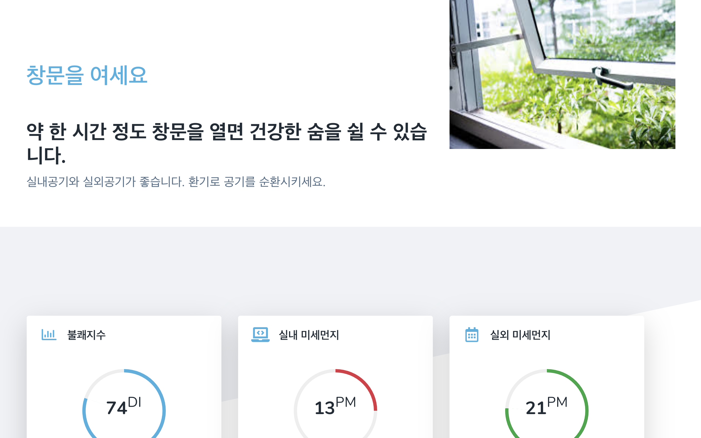
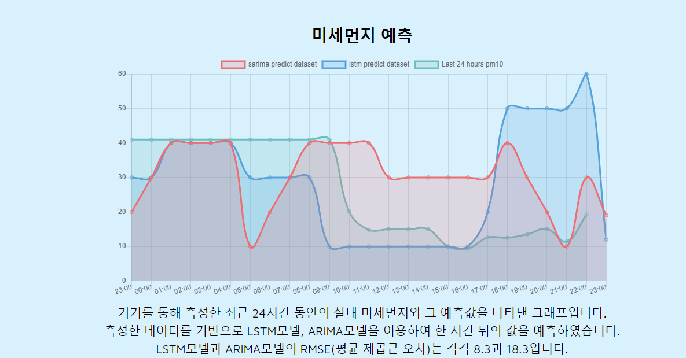

# ssuair

미세먼지 측정 및 예측을 통한 환기 추천 프로젝트.

미세먼지 및 온, 습도를 측정할 수 있는 아두이노 장비를 만든 후 숭실대학교 정보과학관 301호와 1층 실습실에 설치하였다. 데이터들은 thingspeak서버로 5분주기마다 보내진다. 공공api를 이용하여 외부의 미세먼지 및 대기상태 정보를 가져와 내부의 미세먼지 상태와 비교하고, 미세먼지에 영향을 끼치는 요인을 조사 및 분석하였다. 두 달간 학교에서 데이터를 수집하였고, LSTM모델과 S-ARIMA모델을 사용하여 하루의 미세먼지 추이를 예측하여 보았다.

학교에서 측정하던 아두이노 장비들을 집으로 가져와, 집에서의 미세먼지 변화 추이를 관찰하고 그 데이터를 기반으로 환기 방안을 추천해준다. Flask 웹 서버를 이용하여 만들어진 모델들을 서비스한다.

웹을 통해 한 시간 후의 미세먼지 및 실내 공기질 상황을 알려준다. 또한, 외부의 대기질과 비교하여 환기 방안을 추천해준다.

